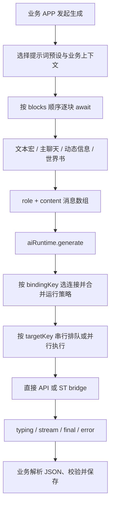

# 小白 OS 异步预设：源码分析与实施方案

本次已读取原对话附件 `my-computer.zip`，并下载核对 LittleWhiteBox 源码。附件在当前 Windows 会话中的实际路径由原对话附件工具返回，不依赖不存在的 `/mnt/data` 挂载。

LittleWhiteBox 基线：`960b3233c90cdd7de7ac61becb7f00b05fa8a21b`。
仓库：[RT15548/LittleWhiteBox](https://github.com/RT15548/LittleWhiteBox/tree/960b3233c90cdd7de7ac61becb7f00b05fa8a21b)。以下源码位置均来自实际读取，不沿用原对话的目录推测。

**结论：可以接入。最值得移植的是可编排提示词块、动态数据源、预设与业务绑定。小白 OS 已有供应商网关和后台维护机制，不需要再复制一套请求器。**

本次交付的是第一阶段可应用源码补丁：导入、异步编译、共享网关适配和测试。它尚未接入桌面设置界面或 APP 自动执行路径，不能作为完整安装包使用。下面给出了余下各阶段的具体修改位置和验收条件。

## 1. 附件中的实际实现

附件源码根目录为 `my-computer/`。未发现独立命名为 `asyncPreset` 的模块；用户所指能力分布在以下文件中。界面页名为“预设”。

| 职责 | 文件与关键位置 |
| --- | --- |
| API 配置、功能绑定、存储、预设数据规范化 | `js/apps/network/api-config/index.js:7`，`:388`，`:577`，`:620` |
| 预设编辑器、块增删开关排序、导入导出、预览 | `js/apps/network/preset/index.js`；保存 `:2095`，导出 `:2160`，导入 `:2180` |
| 动态信息解析 | 同文件 `buildInfoSourceResolvedText:1683` |
| 宏替换与有序异步编译 | 同文件 `applySillyTavernPresetMacros:1806`、`buildMessagesFromPresetBlocks:1821` |
| 主聊天选取与 XML 标签过滤 | `js/apps/network/main-chat/index.js:249` |
| 世界书读取、触发筛选 | `js/apps/network/world-book/index.js:860` |
| 独立生成、流式处理、取消、同目标队列 | `js/core/ai-runtime.js`；队列 `:192`、直连 `:465`、执行 `:639`、入口 `:839` |
| QQ 消费示例 | `js/apps/qq/runtime/controller-chat.js:1922`、`:2436` |

### 数据结构

API、提示词和执行策略分开保存。`localStorage['my-computer.aiSettings']` 主要包含：

```text
apiProfiles[]                         连接配置（端点、密钥、模型、参数、策略覆盖）
apiBindings[bindingKey]               默认 / QQ聊天 / 总结 / 空间 / Twitter / 档案所用连接
presetEntries[] = { id, name, blocks[] }
selectedPresetId                     当前编辑/默认提示词预设
qqChatPresetId / qqSummaryPresetId / qqQzonePresetId
mainChatContextN / mainChatUserN / mainChatXmlRules
worldBookEntries[]
aiRuntimePolicy                      全局执行策略
```

块结构为 `{id, name, role, messageRole, text, sourceId, sourceName, sourceScope, enabled}`。原规范化最多保留 60 块，普通文本块截到 20000 字符；动态块不保存解析后的正文。API 连接预设和提示词预设是两种独立对象。

| role | 编译行为 |
| --- | --- |
| `system` / `user` / `assistant` | 替换文本宏，保持该消息角色 |
| `_context` | 按主聊天设置筛选历史，转成“主聊天用户/主聊天AI：…”文本，输出 system 消息 |
| `_info` | 异步读取应用信息，按 messageRole 输出，默认 system |
| `_worldinfo` | 异步解析指定世界书，按 messageRole 输出 |

信息源包括 QQ 待发送消息、额外输入、联系人、好友简表、聊天历史，Qzone 动态，Twitter 账号/时间线/新闻，以及角色档案。它们依赖附件项目各 APP 的运行时数据结构，不能把 sourceId 原样搬过去就认为能读取小白 OS 数据。

主聊天默认选最近 10 条 AI 消息；用户消息另有范围设置。XML 规则可以按标签和 AI 消息范围选取内容，不能简化成“最后 N 个完整轮次”。

世界书配置路径会按上下文判断条目是否触发、排序后最多取 20 条。预设中的世界书槽还存在直接读取的回退路径。这是附件自己的实现，不能宣称与宿主完整 World Info 扫描语义完全等价。

### 从点击到落地的数据流



“异步”有两个层次：编译器逐块等待异步数据源；运行器异步调用模型并向 APP 派发响应。**块本身并非并行模型任务，也没有预设 DAG 或每块独立请求模型的机制。**

默认策略是 `streamEnabled=true`、`responseDispatchMode='final'`、显示输入中、同目标串行。接收流式响应与逐段派发给 APP 是两个独立选项；即便开启 stream 派发，仍会有最终 final 事件。默认请求超时是 900000ms。

直连分支向已配置端点发送 OpenAI 风格的 messages 请求；bridge 分支调用 ST bridge。QQ 聊天消费者明确指定 `transport:'direct'`，final 回调负责提取 JSON、应用到 QQ 数据并请求保存。编译器和 AI runtime 都不应代替业务层解释这些数据。

### 移植时不照搬的问题

1. `ensureSerialTargetExecution` 保存的是 `next.finally(...)`，清理时却比较 `=== next`，清理条件不会成立；对失败任务，那个 finally 返回的 Promise 还可能产生未处理拒绝。保持串行链身份一致并消费拒绝，或直接使用小白现有 FIFO。
2. `abortTarget` 遍历 activeRequests，排队但尚未启动的任务不在其中，不能据此保证整条目标队列被取消。
3. `generate` 排队时和 `runSingleRequest` 执行时分别读取设置；用户在排队期间换配置可能使队列策略与实际执行配置来自不同时间。移植应明确定义并冻结 job 使用的预设、绑定与来源。
4. `runSingleRequest` 的 typingStart、请求构造位于主 try/finally 之前；若前置步骤抛错，正常清理路径可能被绕过。
5. 未识别的信息源会回退到模板文本。移植时应显示缺失映射并阻止执行，不能把未解析的占位文本当成真实信息。

上述为源码审阅发现，未在原应用浏览器中复现。

## 2. 小白 OS 的实际接入点

当前实际业务目录为 `modules/xiaobai-os/apps/agent-api/`，不是先前猜测的 `host/apps/`。

| 附件能力 | 小白 OS 对应位置及处理方式 |
| --- | --- |
| API 配置页 | `apps/agent-api/ui/AgentApiApp.vue`；增加提示词预设页签，现有连接表单保留 |
| 页面与 Host 通信 | `apps/agent-api/host/controller.ts`；增加明确的 preset 操作 |
| 共享连接设置 | `capabilities/agent/gateway.ts` → `modules/agent-core/settings-repository.js`；继续复用 |
| 提示词数据存储 | 建议扩展 OS `host/settings-repository.ts` 与 `host/settings-normalization.ts`，新增专用 promptPresets 字段 |
| 预设编译 | 本次新增 `capabilities/agent/prompt-preset.ts` |
| 供应商执行 | `gateway.run/openSession` → `agent/browser-entry.ts` → `agent-core` 适配器 |
| 手动前台生成与取消 | 复用 APP execution 生命周期；四次元壁已有 `apps/fourth-wall/host/generation-runtime.ts` |
| 地图/任务后台生成 | `capabilities/maintenance/runner.ts`、`job-executor.ts`、`registry.ts`；预设在 participant 的 createSession 处接入 |
| 消息业务上下文 | `apps/messages/prompt/reply-compiler.ts`、`reply-prompt.ts` 与世界书扫描器；按现有业务契约适配 |

共享连接设置事实来源是 `AssistantStorage` 中的 settings；Agent API 页已有的 `presets` 是共享连接配置预设。**新增提示词预设不能覆盖它。** OS 只存提示词库、业务绑定和自身运行偏好，不能复制 API Key、端点、模型形成第二份连接设置。

维护机制还拥有接受轮来源快照、FIFO、提交守卫和领域 staging。自动任务由已保存的 User 消息确认上一轮触发；切聊、来源变化和关闭自动维护会使不再有效的结果失效。新增预设不能改成每个流式 token 或每次打开设置页就请求模型。

地图与任务同一接受轮可共享一个 provider session。如果将来要求二者绑定不同 API 连接，应按连接配置分组创建 session，并重新设计相应队列和测试；不能仅在 APP 设置里加一个下拉框。

### 跨供应商限制

`agent-core/adapters/anthropic.js` 和 `google.js` 会收集 system 消息；OpenAI-compatible 保留的结构不同。附件允许任意顺序放置 system 块，因此其所有预设并不天然可跨供应商等价执行。

本次编译器保留原顺序；到通用 gateway 边界时只接受“前置 system 块 + user/assistant 对话”。若 system 穿插到对话后面，会给出明确错误。未来可以增加特定供应商模式，但 UI 必须告知实际发送结构，不能悄悄重排。

## 3. 具体实施顺序

### 阶段一：可测试编译核心——本次已提供

- `importPromptPresets`：读取附件的 v1 导出、单个预设、数组或 presets 包装；仅取已知字段，不携带连接密钥。不截断超长提示词，改为报错。
- `compilePromptPreset`：支持六种角色、启用开关、有序异步数据源、宏解析接口；编译前复制草稿，编译中检查取消。
- `toAgentPresetPrompt`：转换为现有 `systemPrompt + messages` 接口，校验可移植消息顺序。
- `runPromptPreset`：显式手动执行原语，读取现有 gateway 配置并调用 gateway.run；流式回调和最终结果均检查取消，不启用工具、不写业务状态。
- 原项目的宏语法、World Info 扫描与 QQ 等动态信息源通过 resolver 注入；本次没有复制这些业务实现。

### 阶段二：Agent API 设置界面与持久化

修改 `types.ts`、`host/settings-normalization.ts`、`host/settings-repository.ts`，为 OS 设置增加：

```ts
promptPresets: {
    version: 1,
    entries: PromptPreset[],
    bindings: {
        // 业务 ID -> 提示词预设 ID；空绑定沿用现有业务提示词
    }
}
```

扩展 repository 的串行 mutation，继续走现有扩展设置保存路径。读取缺失字段时默认空库；迁移后原 OS 开关、地图/任务偏好及四次元壁设置必须保持一致。库内 ID 冲突在导入层显式重分配，并同步批量导入内部引用；删除被绑定的预设须先解除或重绑。

`AgentApiApp.vue` 增加“API 连接 / 提示词预设”页签，预设页支持列表、命名、复制、删除、块编辑、开关、排序、导入导出及编译预览。预览展示编译后的角色和正文；动态数据源缺失时列出具体块并禁用试运行。

`controller.ts` 增加 `agent-api/presets/load/save/preview` 与独立试运行入口，并检查 payload。编辑和预览不联系模型供应商。试运行由明确按钮触发，携带请求 ID；取消、关闭页面和 execution 清理必须中断对应请求。长请求采用立即返回 job ID + progress/result 推送，避免把整个生成挂在普通 frame request 超时上。

验收：刷新后库与绑定保留；导出不含密钥；不改共享连接配置；打开页面零模型请求；加载/错误/空库有明确界面。

### 阶段三：先接手动消费者，再接自动维护

先选四次元壁或消息回复作为真实消费者。未绑定预设时沿用既有编译路径；有绑定时，在现有 prepare/compile 阶段注入新编译器，结果仍进入原有解析和提交路径。排队前捕获聊天 scope、预设版本和来源快照，resolver 只读取该快照。

动态数据源采用业务注册表：`messages.history`、`messages.contacts`、`map.snapshot`、`tasks.snapshot`、`extraInput` 等。旧 QQ/Qzone/Twitter sourceId 不自动假定等价；能确定含义的由适配器转换，其余保留原标识并提示用户重新选择。世界书复用小白已有扫描能力，并单独说明与附件原匹配算法的差异。

宏处理应使用绑定到捕获上下文的宿主替换器。随机/掷骰宏若参与预览确认，应保存并发送同一次编译结果，否则预览与执行可能不同。正文和数据块的可信角色遵循业务约定。

验收：同一快照生成可预期消息；运行时切换聊天不会把结果写入另一聊天；编辑草稿不改变正在执行的任务；连接失败、解析失败与取消不会写入半成品。

### 阶段四：地图/任务维护预设

在各自 `maintenance` participant 的 `createSession(source, mode)` 中编译绑定预设，不改通用 runner 中的业务分支。维护输出必须继续保留原工具声明、业务约束和 `MaintenanceSession` 的 staging/commit 协议。预设仅配置被允许的附加规则/数据，不能替换提交守卫或通过修改提示词绕过工具验证。

注意 `MaintenanceDataMessage` 只允许 system/user；普通预设中的 assistant 示例不能直接强转。维护预设需要单独限制块类型或做明确的数据包装适配。

验收：一次接受轮按原约定触发；自动开关关闭零请求；来源失效丢弃结果；多 participant 结果隔离；失败任务不堵后续 FIFO；原维护用例全部通过。

## 4. 补丁范围与验证边界

本次补丁仅新增编译模块与测试，不修改 Workshop、本机已安装的小白 X、共享 API 设置或原附件。应用后不会自动出现新按钮，也不会自动运行新任务。阶段二至四仍需实现，不能把这个基础补丁当成完整功能。

取消采用协作式 AbortSignal：resolver 应遵守 signal；若 resolver 永不返回且忽略 signal，编译 Promise 也会等待。调用方还需设置超时并拥有生命周期、排队、聊天有效性和提交检查。`runPromptPreset` 不提供持久任务或跨页面后台调度。

测试覆盖导入、六种块解析顺序、缺失数据源、草稿快照、system 顺序、取消与迟到结果、共享网关参数及流式回调。具体执行结果和应用步骤见补丁包 `README.md`。没有调用真实付费模型，也没有在 SillyTavern/TauriTavern 中做运行验证。
